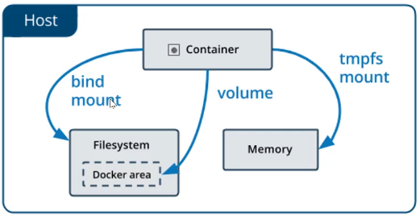
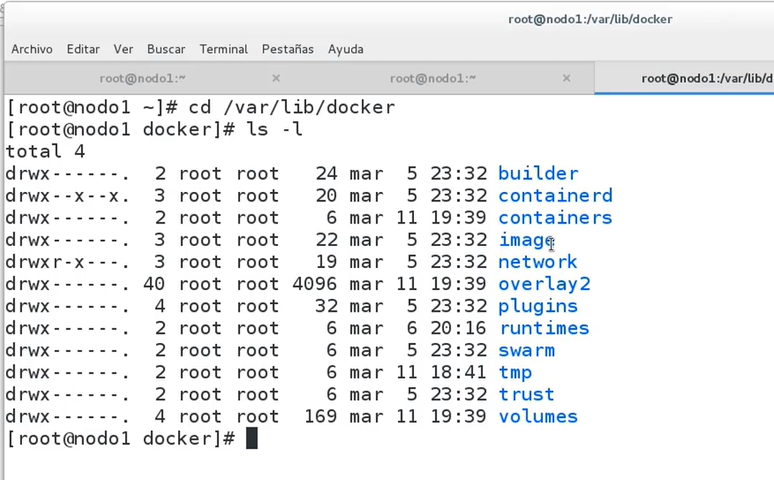
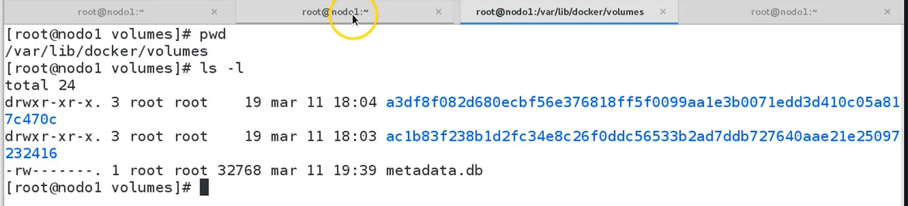
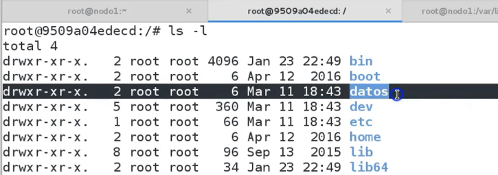

# Introducción al almacenamiento

## Introducción a los volumenes

Hay 3 tipos de storage en Docker
- Volumenes: Nos permite persistir información dentro de un área que es gestionada por Docker
- Bind mount: Permite que se mapee un directorio dentro de la maquina física que apunte a un directorio del contenedor
- tmpfs mounts (linux)/ named Pipes(Windows): Montajes en memoria, cuando el contenedor se destruya se perderá la información.

- Volumenes: Se alamcenan en un determinado directorio que es administrado por Docker (/var/lib/docker/volumes en linux), los procesos que no son docker no deben tocar éste directorio, los vlumenes son la la mejor manera de persistir datos en Docker.

- Bind Mounts: Puede asociarse con cualquier directorio dentro del servidor. Los proceso que no son docker pueden modificar éstos ficheros

- tmpfs mounts/Named Pipes: Se alacenan únicamente en la memoria del sistema host y nunca se escriben en el sistema de archivos.

## Crear un volumen en un contenedor (Primera opción para crear volumenes)

Ruta donde se encuentran los volumenes de los contenedores

**Este directorio no se toca manualmente**
~~~
$> cd /var/lib/docker/
$> ls -la
~~~

**Entrar a carpeta de volumenes**
~~~
$> cd /var/docker/volumes
$> ls -la
~~~

~~~
$> docker run -it -v /datos --name ubuntu1 ubuntu bash
~~~
**Dentro del contenedor listar**
~~~
$> ls -la
~~~

Encontramos que se encuentra una imagen en que se corresponde con el volumen creado recientemente

**Fuera del contenedor listar**
~~~
$> ls -la
~~~

- Cabe mencionar que si entro al hash que está relacionado con el nuevo volumen, podré acceder a los datos que se hayan persistido en el contenedor de docker 
- Aúnque me salga del contenedor el volumen será persistido, porque el contenedor aún lo tiene asociado.

**Si levantamos nuevamente el contenedor de docker que se encuentra detenido**
~~~
$> docker start -i ubuntu1
$> cd /datos
$> ls -la
~~~
**Sigo teniendo los mismos datos**

## Ver información de volúmenes

**Comando**
~~~
$> docker volume
~~~
- create        Create a volume
- inspect       Display detailed information on one or more volumes
- ls            List volumes
- prune         Remove all unused volumes
- rm            Remove one or more volumes

**Ejemplo de docker volume inspect**
~~~
$> docker volume inspect <hash>
~~~

## Crear un volumen independiente y compartilo con otros contenedores

~~~
# docker volume create <nombre del volumen>
$> docker volume create vol1
~~~

**Si se lista los volumenes veremos que se crea el volumen en lugar de con el valor hash se crea con el nombre del volumen que se le ha asignado**

- Inspeccionando el volumen
~~~
# docker volume inspect vol1
~~~

- Asociar un volumen ya creado con un nuevo contenedor

~~~
# docker run -it --name <nombre contenedor> -v <volumen creado>:<Path en contenedor> <imagen docker> bash
$> docker run -it --name ubuntu7 -v vol1:/dir1 ubuntu bash
~~~

- Para validar que el volumen se encuentra asociado al contenedor

~~~
# Inspeccionar el volumen creado
$> docker volume inspect vol1
# Inspeccionar el contenedor ubuntu7 
$> docker inspect ubuntu7 > ubuntu7.txt
# Revisar la sección mounts
~~~

- Asociar el volumen a otro contenedor incluso se puede asociar cómo un volumen de solo lectura

~~~
$> docker run -it --name ubuntu8 -v vol1:/datos:ro ubuntu bash
~~~

## Compartir múltiples volúmenes entre contenedores

1. Listamos los volumenes (máquina alfitrión)
~~~
$> cd /var/lib/docker/volumes
$> ls -la
~~~

2. Crear contenedor con su volumen (contenedor)
~~~
$> docker run -it -v /datos --name ubuntu4 ubuntu bash
$> ls -la
# Entramos al volumen
$> cd datos
$> touch f1.txt
~~~

3. Listo los volumenes (máquina alfitrión)
~~~
$> cd /var/lib/docker/volumes
$> ls -la
# Entro al volumen para revisar los datos
$> cd <hashnomber>/_data
#> ls -la    # Se debe ver el archivo f1.txt
~~~

4. Crear otro contenedor con el mismo volumen
~~~
$> docker run -it --name ubuntu5 volumes-from ubuntu4 ubuntu bash
# Entrar al directorio datos
$> cd datos
$> ls -la # Se debe listar el archivo f1.txt 

# Si ahora creo un nuevo archivo en el segundo contenedor
$> touch f2.txt # Se debe visualizar en el primer contenedor y si lo listo en la maquina afiltrion también podré ver los archivos
~~~

**Nota: Cuando ningún contenedor está apuntando a un volumen, este volumen ya no vale (ya no se puede reutilizar, entonces debo iniciar desde cero)**

- Si me salgo de los contenedores para que se detengan todos, el volumen sigue existiendo poque sigue estando asociado a 3 contenedores que están detenidos
~~~
# Detener los contenedores
$> exit  # En cada uno
~~~
En la maquina afiltrión revisar que los contenedores siguen estando aunque se encuentran en estado detenido
~~~
$> docker ps -a
~~~

- Si ahora borro los contenedores
~~~
$> docker rm ubuntu4
$> docker rm ubuntu5
$> docker rm ubuntu6
~~~
- **El volumen aunque no lo parezca se pone en estado inutilizable porque no tendo acceso a el, es decir ya no lo puedo asociar a ningún contenedor**
- **Sin envargo los ficheros no desaparecen, si validas desde la maquina afiltrión se puede acceder a los ficheros, pero ya no puedo montarlo**
- Entonce los volumenes sin usar se deben borrar con el comando **docker volume prune** o **docker volume rm <hash>**

## Borrar volumenes

~~~
docker volume rm <hashname>
~~~

**Si el volumen que se pretende borrar se encuentra en uso éste no se podrá borrar**

~~~
docker volume prune
~~~
**Éste comando borrará los volumenes que se encuetran en estatus inused**

## Bind Mounts
Deja el volumen en un directorio que no es tan accesible para poder manejarlo, por lo que se puede crear el volumen en una ruta definida

- Cómo compartir un directorio completo del host con el contenedor
~~~
# -v <path_host>:<path_contenedor>
docker run -it -v /root/dir1:/dir1 --name ubuntu2 ubuntu
~~~

**Si el directorio alguno de los dos: <path_host>:<path_contenedor> no existe lo crea**

- Si en el host entramos a la ruta y creamos un directorio lo debemos de ver en el contenedor
~~~
# Dentro del contenedor
cd dir1
touch f1.txt
# Dentro del host alfitrión
cd dir1
ls -la  # lo debe de ver
~~~

**Este nuevo volumen no se podrá ver en la ruta: /etc/lib/docker/volumes, que lo que se está ligando es la ruta del host con el del contenedor más que un volumen sería un montaje**
~~~
docker inspect ubuntu2 > ubuntu2.txt
~~~
**En lugar de llamarlo volumen lo llama binds**

## Almacenamiento temporal. Tipo TMPFS

Crear un contenedor 
~~~
docker run -d -i --name ubuntu15 ubuntu
docker exec -it ubuntu15 bash
# Creo un directortio (volumen temporal)
$> mkdir dir1
$> cd dir1
$> touch f1.txt
# Saldo del contenedor y lo detengo
exit
docker stop ubuntu15
# lo vuelvo a levantar
docker start ubuntu15
docker exec -it ubuntu15 bash
# Compruebo que sigue estando el directorio y el archvio
$> cd dir1
$> ls   # Mientras el contenedor siga existiendo el volumen sigue ahí
~~~

Otro tipo
~~~
# Crear directorio temporal en el contenedor este no va a existir a los arranques y paradas del sistema
docker run -d -i --name ubuntu16 --tmpfs /datos ubuntu
docker exec -it ubuntu16 bash
cd datos
touch borrar.txt
ls -l
cd ..
mkdir dir1
cd dir1
touch f1.txt
exit
# Detengo el contenedor par luego volver a aancalo y validar si existen las carpetas
docker stop ubuntu16
docker start ubuntu16
docker exec -it ubuntu16 bash

ls dir1

~~~

## Volúmenes en Windows

## ¿Dónde se encuentran los volúmenes en Windows Linux Containers?

## ¿Dónde se encuentran los volúmenes en modo Windows Containers?
