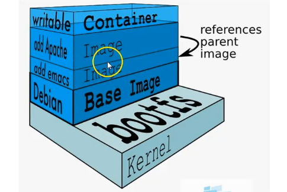

# imagenes

## Introdución

Las imagenes en Docker están formadas por varias capas de solo lectura

1. Monta el fichero de arranque: bootfs (lectura)
2. Monta el sistema de ficheros de root: rootfs (lectura)
3. Monta las n capas de imagenes (lectura)

Y por ultimo cuando creamos el contenedor, monta una capa por encima (lectura/escritura)

## Modificar el contenedor desde el modo iterativo

Cómo podemos modificar una imagen, como podemos 

~~~
docker run -it --name ubuntu1 ubuntu bash
$> wget http://www.google.com 
bash: wget: command not dound

# MOIFICACIÓN DE CONTENEDOR
$> apt-get update
$> apt-get instal wget 
$> wget http://www.google.com 

# AHORA SI FUNCIONA
~~~

Crear un nuevo contenedor sin modificaciones

~~~
docker run -it --name ubuntu2 ubuntu bash
$> wget    # No se tiene wget
bash: wget: command not found
~~~

## Cómo saber qué cambios ha tenido un determinado contenedor - docker diff

~~~
docker diff ubuntu1
~~~

Muestra los combios que ha tenido el contenedor
(Al inicio de la linea coloca una letra)

A (Add)    - Si es nuevo 
C (Chage)  - Si es un cambio
D (Delete) - Si se elimino

## Crear una imagen manual mente - docker commit

